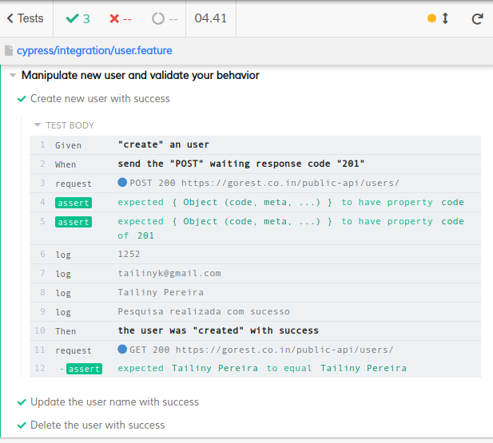

<h1 align="center">Automação de teste API com cucumber e cypress</h1>

O projeto realizado tem como objetivo manipular cadastro de usuários utilizando Cypress (ferramenta de automação de testes que utiliza JavaScript).

### Funcionalidades

- [x] Cadastro de usuário
- [x] Alteração de usuário
- [x] Exclusão de usuário

### Pré-requisitos, instalação e rodar os testes:

Antes de começar, é necessário ter instalado em sua máquina as seguintes ferramentas:
    [Node.js](https://nodejs.org/en/download/package-manager/)
    [NPM](https://www.npmjs.com/get-npm)
    [Editor de texto](https://code.visualstudio.com/)

<b>Instalação Cypress</b>
<ul><i>npm install cypress</i></ul>

<b>Sobre o projeto:</b>
<ul><b>Na pasta cypress > integration - </b>Está a feature de teste</ul>
<ul><b>Na pasta cypress</b> > support > steps - </b>Está o arquivo responsável por interpretar os steps da feature</ul>

<b>Como rodar o projeto:</b>

<ul><b>Pelo terminal:</b></ul>
    <ul><li><i>npx cypress run</i></li></ul>
<ul><b>Pelo loader do Cypress</b></ul>
    <ul><li><i>npx cypress open</i></li></ul>
    <ul><li><i>Clicar em user.feature</i></li></ul>

